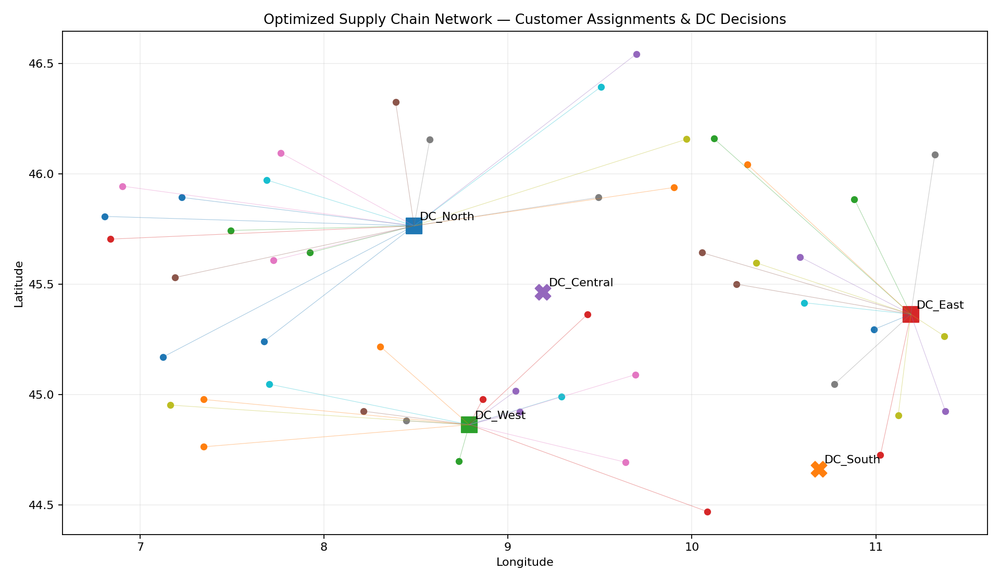

# 🌐 Supply Chain Network Design with Linear Programming

A geographic supply-chain optimization project using **Python, PuLP and Folium** to determine which distribution centers should open and how customer demand should be allocated while minimizing fixed and transportation costs.

> 📓 [Full notebook](notebooks/supply_chain_network_with_linear_programming.ipynb)

## 🎯 The Facility Location Problem

The model evaluates **50 simulated customers around Milan, Italy** and **5 candidate distribution centers**. It balances the cost of opening facilities against distance-based shipping cost while respecting customer-assignment and DC-capacity constraints.

## 🗺️ Interactive Network Exploration

GitHub README files cannot execute Folium/Leaflet JavaScript directly. The repository therefore includes the real interactive HTML maps plus a static README preview.

### 1. Customer Demand Geography

[🌍 Open interactive customer map](maps/customers_map.html)

The customer layer contains clickable/hoverable geographic points with customer IDs and demand.

### 2. Candidate Distribution Centers

[🏭 Open interactive candidate-DC map](maps/candidate_dc_map.html)

The candidate layer adds the five possible warehouse locations with fixed-cost and capacity information.

### 3. Optimized Network



[🚀 Open interactive optimized network map](maps/optimized_network_map.html)

The interactive network contains customer points, opened/closed DC markers, assignment lines and operational tooltips.

## 📊 Optimization Result from the Notebook

| KPI | Result |
|---|---|
| Solver status | **Optimal** |
| Total optimized cost | **$1,066,391.00** |
| Opened DCs | **DC_North, DC_West, DC_East** |
| Closed DCs | **DC_South, DC_Central** |
| DC_North served demand | **12,693 / 25,000** |
| DC_West served demand | **8,195 / 20,000** |
| DC_East served demand | **5,792 / 18,000** |

## 🧮 Model Logic

**Decision variables**

- `y[dc]`: whether a distribution center is opened.
- `x[dc, customer]`: whether a customer is assigned to a DC.

**Objective**

Minimize total network cost:

```text
Total Cost = Fixed Facility Cost + Customer Assignment / Shipping Cost
```

**Constraints**

1. Every customer is served exactly once.
2. Customers can only be assigned to an opened DC.
3. Assigned demand cannot exceed an opened DC's capacity.

## 🔄 Workflow

```text
Simulate Customer Demand
        ↓
Generate Candidate DC Locations
        ↓
Calculate Haversine Distances
        ↓
Build Fixed + Shipping Costs
        ↓
Define Binary Decision Variables
        ↓
Add Assignment + Capacity Constraints
        ↓
Solve with PuLP / CBC
        ↓
Select Optimal DCs
        ↓
Visualize Customer-to-DC Assignments
```

## 💼 Business Interpretation

The optimization selects three DCs because their combined fixed and variable transportation costs produce the lowest feasible network cost. DC_South and DC_Central remain closed because their additional fixed costs do not generate enough transportation savings to justify opening them.

The model also provides a reusable foundation for **what-if analysis** involving demand growth, cost changes, disruptions, facility availability, service requirements and capacity expansion.

## 🚀 Extensions

Real-world versions can incorporate multiple products, multimodal transportation, time windows and SLAs, dynamic demand, carbon objectives, uncertain costs and demand, vehicle capacities, and stochastic optimization.

## 📂 Repository Structure

```text
Supply-Chain-Network-with-Linear-Programming/
├── README.md
├── requirements.txt
├── .gitignore
├── notebooks/
│   └── supply_chain_network_with_linear_programming.ipynb
├── maps/
│   ├── customers_map.html
│   ├── candidate_dc_map.html
│   └── optimized_network_map.html
└── images/
    └── optimized_network_preview.png
```

## 🛠️ Requirements

```bash
pip install -r requirements.txt
```

Then open the notebook or the HTML maps locally in a browser.
